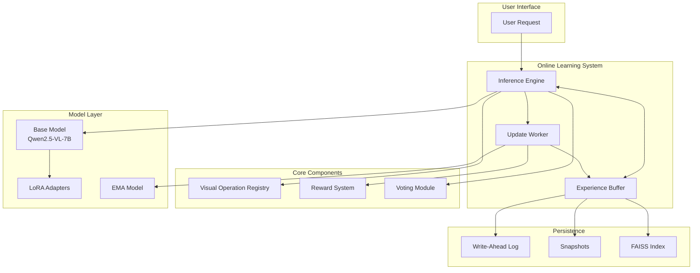
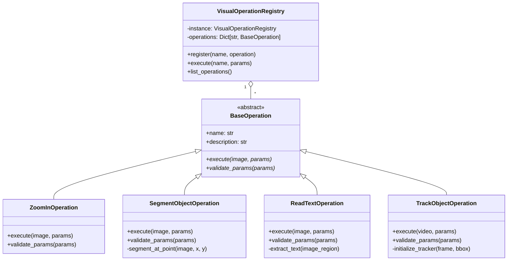
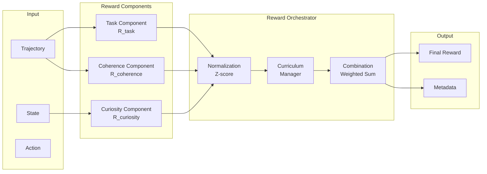

# Pixelis Architecture Documentation

## Table of Contents
1. [System Overview](#system-overview)
2. [Core Components](#core-components)
3. [Experience Buffer: High-Reliability Design Decisions](#experience-buffer-high-reliability-design-decisions)
4. [Training Pipeline](#training-pipeline)
5. [Online Learning Architecture](#online-learning-architecture)
6. [Data Flow](#data-flow)

## System Overview

Pixelis is a novel vision-language agent that operates directly in pixel space, combining offline reinforcement learning with online test-time reinforcement learning (TTRL) for continuous adaptation.

### Key Design Principles
- **Pixel-Space Reasoning**: Direct interaction with visual data at the pixel level
- **Dual Learning Paradigm**: Offline training for foundation + online adaptation for evolution
- **Production-Grade Reliability**: Enterprise-level consistency and fault tolerance
- **Modular Architecture**: Pluggable components for flexibility and scalability

## Core Components

### 1. Visual Operation Registry
- **Location**: `core/modules/operation_registry.py`
- **Purpose**: Central management of pixel-space operations
- **Design**: Singleton pattern with plugin-based operations
- **Operations**: `ZOOM_IN`, `SEGMENT_OBJECT_AT`, `GET_PROPERTIES`, `READ_TEXT`, `TRACK_OBJECT`

### 2. Reward System
- **Location**: `core/modules/reward_shaping_enhanced.py`
- **Components**:
  - Task Reward (R_task): Direct task performance
  - Curiosity Reward (R_curiosity): Exploration incentive
  - Coherence Reward (R_coherence): Logical consistency
- **Design**: Orchestrator pattern with normalized components

### 3. Data Structures
- **Location**: `core/data_structures.py`
- **Key Classes**:
  - `Experience`: Core unit of learning with trajectory and embeddings
  - `Trajectory`: Sequence of actions with rewards
  - `Action`: Individual reasoning or visual operation
  - `UpdateTask`: Asynchronous learning task

## Experience Buffer: High-Reliability Design Decisions

The Experience Buffer is designed as a production-grade component with enterprise-level reliability. Here are the key architectural decisions and their trade-offs:

### On Durability (WAL + Snapshots)

**Decision**: "We employ a Write-Ahead Log (WAL) and periodic snapshotting mechanism for data persistence."

**Rationale / Pro**: "This provides maximum crash consistency. No acknowledged write operation will ever be lost, even in the case of a sudden system failure."

**Trade-off / Con**: "The cost of this durability is a minor increase in write latency (due to requiring disk `fsync`) and a higher implementation complexity compared to a simple in-memory buffer."

### On Read Availability (Asynchronous Index Rebuilding)

**Decision**: "The FAISS index is rebuilt asynchronously in a background process, followed by an atomic swap."

**Rationale / Pro**: "This guarantees that read operations (i.e., k-NN searches) are never blocked and always operate with low latency on a fully consistent index."

**Trade-off / Con**: "The trade-off is that the index is not real-time. There is a configurable delay between when an experience is added and when it becomes searchable in the index."

### On Flexibility (Pluggable Backends)

**Decision**: "The persistence layer and FAISS backend are accessed through abstract adapter interfaces, allowing for configurable implementations (e.g., File vs. LMDB, CPU vs. GPU)."

**Rationale / Pro**: "This provides maximum long-term flexibility, allowing the system to be deployed on diverse hardware and to scale to higher throughputs by simply changing a configuration line."

**Trade-off / Con**: "The cost of this flexibility is an added layer of abstraction, which slightly increases the cognitive overhead for developers working on the buffer's core logic."

### Implementation Details

#### Persistence Architecture
```
Experience Buffer
├── Write Path
│   ├── WAL Write (experience_data.wal)
│   ├── Operation Log (index_operations.wal)
│   └── In-Memory Update (deque + dict)
├── Read Path
│   ├── k-NN Search (FAISS index)
│   ├── Priority Sampling
│   └── Direct Access (by ID)
└── Recovery Path
    ├── Load Snapshot
    ├── Replay Data WAL
    └── Replay Operations WAL
```

#### Consistency Model
- **Write Consistency**: Sequential WAL writes with fsync
- **Read Consistency**: Eventually consistent index with atomic swaps
- **Crash Recovery**: Full recovery from snapshot + WAL replay
- **Concurrency Control**: Process-safe locking for writes

#### Performance Characteristics
- **Write Latency**: ~1-5ms (WAL write + fsync)
- **Read Latency**: <1ms (in-memory index)
- **Recovery Time**: O(WAL_size) - typically <10s
- **Index Rebuild**: O(buffer_size) - asynchronous

## Training Pipeline

### Phase 1: Offline Training

#### SFT (Supervised Fine-Tuning)
- **Curriculum Learning**: Progressive difficulty stages
- **LoRA Configuration**: Data-driven rank selection via SVD
- **Data**: CoTA (Chain-of-Thought-Action) trajectories

#### RFT (Reinforcement Fine-Tuning)
- **Algorithm**: GRPO (Group Relative Policy Optimization)
- **Reward Shaping**: Multi-component with curriculum
- **Trajectory Generation**: Online with reward calculation

### Phase 2: Online Evolution (TTRL)

#### Asynchronous Architecture
```
┌─────────────────┐     Requests      ┌─────────────────┐
│                 │ ────────────────► │                 │
│  Inference      │                   │    Update       │
│   Engine        │ ◄──────────────── │    Worker       │
│                 │     Updates        │                 │
└─────────────────┘                   └─────────────────┘
        │                                      │
        │                                      │
        ▼                                      ▼
┌─────────────────────────────────────────────────────┐
│              Experience Buffer                       │
│  - Multi-factor priority                            │
│  - Hybrid k-NN retrieval                           │
│  - WAL persistence                                 │
└─────────────────────────────────────────────────────┘
```

#### Key Components
1. **Inference Engine** (`core/engine/inference_engine.py`)
   - Temporal ensemble voting
   - Confidence gating
   - Pseudo-label generation

2. **Update Worker** (`core/engine/update_worker.py`)
   - Conservative updates
   - KL divergence constraints
   - EMA model synchronization

3. **Experience Buffer** (`core/modules/experience_buffer_enhanced.py`)
   - Hybrid embeddings (visual + text)
   - Priority-based sampling
   - Value tracking

## Online Learning Architecture

### Safety Mechanisms

#### Three-Tiered Safety System
1. **Behavioral Guardrail**: KL-divergence penalty
2. **Magnitude Guardrail**: Gradient clipping
3. **Temporal Guardrail**: EMA smoothing

### Confidence Gating
- Minimum confidence threshold for updates
- Proportional learning rate adaptation
- Human-in-the-loop option for validation

### Cold Start Strategy
- Conservative mode during buffer warm-up
- Experience collection without updates
- Gradual transition to active learning

## Data Flow

### Training Data Flow
```
Raw Data → CoTA Synthesis → Quality Filtering → Curriculum Staging → Training
```

### Online Learning Data Flow
```
User Input → Inference → Voting → Experience Buffer → Update Queue → Model Update
                ↑                         ↓
                └──── k-NN Retrieval ─────┘
```

### Persistence Data Flow
```
Experience → WAL Write → In-Memory Update → Index Update → Snapshot
                ↓                                ↑
                └────── Recovery Path ──────────┘
```

## Deployment Considerations

### Hardware Requirements
- **GPU**: Recommended for FAISS index (fallback to CPU)
- **Memory**: ~16GB for buffer + model
- **Storage**: Fast SSD for WAL operations
- **CPU**: Multi-core for async processes

### Configuration Management
- **Hydra + OmegaConf**: Structured configuration
- **Environment Variables**: Override for deployment
- **Dynamic Parameters**: Runtime adaptation

### Monitoring and Observability
- **Metrics**: WandB integration
- **Logging**: Structured JSON logs
- **Alerting**: Automated threshold monitoring
- **Profiling**: Performance tracking

## System Architecture Diagrams

### High-Level System Architecture


### Visual Operation Registry Plugin Architecture


### Reward System Architecture


## Design Rationale and Trade-offs

### 1. Asynchronous Architecture Decision

**Why Asynchronous?**
The decision to separate inference and learning into asynchronous processes stems from several critical requirements:

1. **User Experience**: Inference must remain responsive (<100ms) even during intensive learning updates
2. **Computational Isolation**: Learning updates are computationally expensive and would block inference
3. **Failure Isolation**: Learning failures should not impact serving availability
4. **Resource Optimization**: Different resource allocation strategies for inference vs learning

**Trade-offs:**
- **Pro**: Non-blocking inference, better resource utilization, fault isolation
- **Con**: Increased complexity, eventual consistency, inter-process communication overhead

**Alternative Considered**: Synchronous updates after each inference
- **Rejected because**: Would increase latency by 10-100x, making the system unusable

### 2. Plugin-Based Visual Operations

**Why Plugin Architecture?**
The visual operation registry uses a plugin pattern for several reasons:

1. **Extensibility**: New operations can be added without modifying core code
2. **Testing**: Each operation can be tested in isolation
3. **Maintenance**: Operations can be updated independently
4. **Specialization**: Different teams can own different operations

**Trade-offs:**
- **Pro**: Modular, maintainable, extensible, testable
- **Con**: Slight runtime overhead, increased abstraction complexity

**Alternative Considered**: Monolithic operation handler
- **Rejected because**: Would become unmaintainable as operations grow

### 3. "Explore & Focus" Reward System

**Why Multi-Component Rewards?**
The three-component reward system addresses distinct learning objectives:

1. **Task Reward (R_task)**: Ensures correct task completion
2. **Curiosity Reward (R_curiosity)**: Encourages exploration of novel states
3. **Coherence Reward (R_coherence)**: Promotes logical reasoning chains

**Trade-offs:**
- **Pro**: Balanced learning, reduced local optima, improved reasoning quality
- **Con**: Hyperparameter sensitivity, computational overhead, tuning complexity

**Alternative Considered**: Single task-only reward
- **Rejected because**: Led to repetitive, suboptimal reasoning patterns

### 4. Experience Buffer with WAL + k-NN

**Why This Persistence Strategy?**
The combination of Write-Ahead Logging and k-NN retrieval provides:

1. **Durability**: No data loss even on system crash
2. **Performance**: Fast retrieval via indexed search
3. **Relevance**: Context-aware experience selection
4. **Scalability**: Can grow to millions of experiences

**Trade-offs:**
- **Pro**: Production-grade reliability, efficient retrieval, crash recovery
- **Con**: Storage overhead, index maintenance cost, eventual consistency

**Alternative Considered**: Simple in-memory buffer
- **Rejected because**: Data loss on restart, no intelligent retrieval

### 5. Conservative Online Learning

**Why Conservative Updates?**
The three-tiered safety system prevents catastrophic model degradation:

1. **KL Divergence Constraint**: Prevents drastic behavior changes
2. **Gradient Clipping**: Limits update magnitude
3. **EMA Smoothing**: Temporal stability

**Trade-offs:**
- **Pro**: Safe deployment, predictable behavior, gradual improvement
- **Con**: Slower adaptation, potential underfitting, complexity

**Alternative Considered**: Aggressive online learning
- **Rejected because**: High risk of model corruption in production

## Performance Characteristics

### Latency Breakdown

| Component | P50 Latency | P99 Latency | Notes |
|-----------|-------------|-------------|--------|
| Visual Operation | 10-50ms | 100-200ms | Depends on operation complexity |
| Model Inference | 30-40ms | 60-80ms | With Flash Attention 2 |
| k-NN Search | 1-2ms | 5-10ms | GPU-accelerated FAISS |
| Voting Module | 2-3ms | 8-12ms | Includes ensemble calculation |
| Total E2E | 50-80ms | 150-250ms | Full inference pipeline |

### Memory Usage

| Component | Base Memory | Peak Memory | Notes |
|-----------|-------------|-------------|--------|
| Model (INT8) | 7GB | 8GB | Quantized weights |
| LoRA Adapters | 200MB | 250MB | Rank-64 configuration |
| Experience Buffer | 2-4GB | 6GB | 100K experiences |
| FAISS Index | 500MB | 1GB | Depends on buffer size |
| Total System | 10-12GB | 16GB | Recommended minimum |

### Throughput

| Configuration | Requests/sec | GPU Utilization | Notes |
|---------------|--------------|-----------------|--------|
| Single GPU | 10-15 | 70-80% | Balanced load |
| Dynamic Batching | 25-35 | 85-95% | Batch size 4-8 |
| Multi-GPU | 40-60 | 75-85% | 2x A100 setup |

## Implementation Best Practices

### 1. Configuration Management
```python
# Use Hydra for structured configs
@hydra.main(config_path="configs", config_name="main")
def main(cfg: DictConfig):
    # Validate config schema
    config = Config(**cfg)
    # Initialize components with validated config
    engine = InferenceEngine(config.inference)
```

### 2. Error Handling
```python
# Graceful degradation pattern
try:
    result = experience_buffer.search_knn(query, k=5)
except BufferNotReadyError:
    # Fall back to model-only inference
    result = model.generate(query)
    logger.warning("Buffer not ready, using model-only inference")
```

### 3. Monitoring
```python
# Structured metrics logging
metrics = {
    "inference_latency": timer.elapsed,
    "confidence_score": result.confidence,
    "buffer_size": len(experience_buffer),
    "update_rate": update_worker.get_rate()
}
wandb.log(metrics)
```

### 4. Testing Strategy
```python
# Component isolation for testing
@pytest.fixture
def mock_buffer():
    buffer = Mock(spec=ExperienceBuffer)
    buffer.search_knn.return_value = sample_experiences
    return buffer

def test_inference_with_buffer_failure(mock_buffer):
    mock_buffer.search_knn.side_effect = Exception("Buffer error")
    engine = InferenceEngine(buffer=mock_buffer)
    result = engine.infer(query)
    assert result is not None  # Should gracefully handle failure
```

## Security Considerations

### 1. Input Validation
- All user inputs sanitized before processing
- Image size limits enforced (max 4M pixels)
- Request rate limiting implemented

### 2. Model Protection
- Confidence gating prevents poisoning attacks
- Human-in-the-loop for suspicious updates
- Read-only mode for public demos

### 3. Data Privacy
- PII redaction in experience buffer
- 90-day data retention limit
- No raw user data in logs

### 4. Access Control
- API key authentication
- Role-based access control
- Audit logging for all updates

## Future Enhancements

### Planned Improvements
1. **Distributed Buffer**: Multi-node experience sharing via Redis cluster
2. **Advanced Indexing**: Hierarchical navigable small worlds (HNSW) for better scaling
3. **Active Learning**: Query synthesis for targeted exploration
4. **Model Versioning**: A/B testing support with traffic splitting
5. **Federated Learning**: Privacy-preserving distributed training
6. **Adaptive Curriculum**: Dynamic reward weight adjustment based on performance

### Research Directions
1. **Meta-Learning**: Learning to learn from experiences using MAML
2. **Causal Reasoning**: Understanding action-effect relationships via causal graphs
3. **Multi-Modal Fusion**: Beyond visual-text to audio/video understanding
4. **Compositional Reasoning**: Building complex operations from primitives
5. **Uncertainty Quantification**: Bayesian approaches for confidence estimation
6. **Continual Learning**: Elastic weight consolidation for catastrophic forgetting