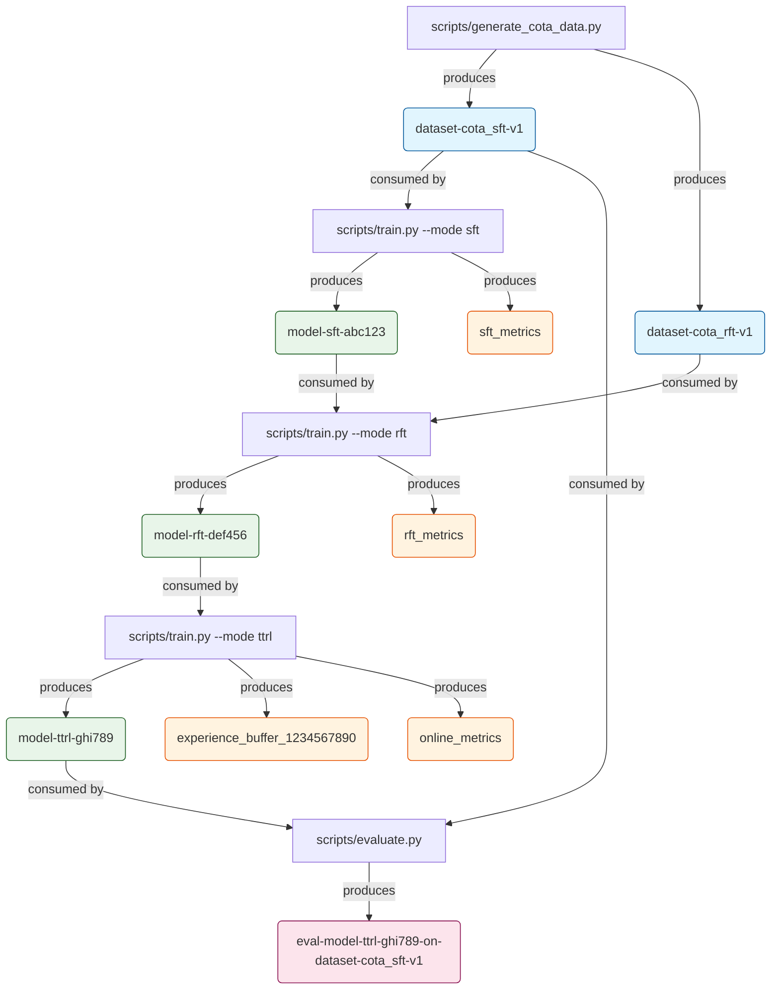

# Reproducibility and Artifact Management Guide

## Overview

The Pixelis project implements a comprehensive reproducibility system that ensures every experimental result can be traced back to its exact inputs, code state, environment, and configuration. This document describes the end-to-end workflow, artifact naming conventions, and best practices for maintaining reproducible research.

## Table of Contents

1. [Core Concepts](#core-concepts)
2. [Artifact Naming Conventions](#artifact-naming-conventions)
3. [End-to-End Workflow](#end-to-end-workflow)
4. [Usage Examples](#usage-examples)
5. [Workflow Visualization](#workflow-visualization)
6. [Best Practices](#best-practices)
7. [Troubleshooting](#troubleshooting)

## Core Concepts

### Artifacts
Artifacts are versioned, immutable snapshots of data, models, configurations, and results. Each artifact is uniquely identified and linked to its lineage.

### Lineage Tracking
Every artifact maintains references to its parent artifacts, creating a complete dependency graph from raw data to final results.

### Environment Capture
The system captures three levels of environment detail:
- **Basic (Level 1)**: Python version, packages, git commit
- **Standard (Level 2)**: + git diff, system info, CUDA details
- **Complete (Level 3)**: + Docker info, environment variables

### Run State Management
Experiments are tracked with explicit states:
- **RUNNING**: Experiment in progress
- **COMPLETED**: Successful completion
- **FAILED**: Experiment failed with errors
- **INTERRUPTED**: Manually stopped

## Artifact Naming Conventions

All artifacts **MUST** follow these naming conventions to maintain organization and searchability:

### Datasets
**Format**: `dataset-<name>-<version>`
- **Examples**: 
  - `dataset-cota_sft-v1`
  - `dataset-cota_rft-v2`
  - `dataset-custom_benchmark-v1`
- **Name**: Descriptive identifier of the dataset's purpose
- **Version**: Incremented for each significant change

### Models
**Format**: `model-<run_id>`
- **Examples**:
  - `model-2x3y5z7q`
  - `model-abc123def`
- **Run ID**: Unique identifier from the WandB/offline run that produced it
- **Note**: This creates an unambiguous link between model and training run

### Checkpoints
**Format**: `checkpoint_<type>_<identifier>`
- **Examples**:
  - `checkpoint_step_1000`
  - `checkpoint_epoch_5`
  - `checkpoint_best`
- **Type**: Step, epoch, or best
- **Identifier**: Numeric value or descriptor

### Evaluation Results
**Format**: `eval-<model_artifact_name>-on-<dataset_artifact_name>`
- **Examples**:
  - `eval-model-2x3y5z7q-on-dataset-mmvet-v1`
  - `eval-model-abc123def-on-dataset-custom_benchmark-v2`
- **Explicitly records**: Which model version was evaluated on which dataset version

### Metrics
**Format**: `<stage>_metrics_<identifier>`
- **Examples**:
  - `sft_metrics_epoch_1`
  - `rft_metrics_episode_100`
  - `online_metrics_step_5000`

### Experience Buffers (TTRL)
**Format**: `experience_buffer_<timestamp>`
- **Examples**:
  - `experience_buffer_1234567890`
- **Timestamp**: Unix timestamp of snapshot

## End-to-End Workflow

### 1. Data Preparation

```python
from core.reproducibility import ExperimentContext, ArtifactManager

# Initialize context for data preparation
with ExperimentContext(name="data_preparation") as ctx:
    # Generate or load data
    data = generate_cota_data(config)
    
    # Log as artifact
    dataset_artifact = ctx.log_artifact(
        name="dataset-cota_sft",
        type=ArtifactType.DATASET,
        data=data,
        metadata={"num_samples": len(data)}
    )
```

### 2. Training

```python
# Training with automatic tracking
@track_artifacts(inputs=["dataset-cota_sft:v1"], outputs=["model", "metrics"])
def train_model(config):
    with ExperimentContext(config, name="sft_training") as ctx:
        # Training code
        model = train(...)
        
        # Automatic checkpoint logging
        ctx.log_model_checkpoint(
            model_path=Path("model.pt"),
            step=1000,
            metrics={"loss": 0.5}
        )
        
        return model, metrics
```

### 3. Evaluation

```python
# Evaluation with lineage tracking
@track_artifacts(
    inputs=["model-2x3y5z7q", "dataset-mmvet:v1"],
    outputs=["evaluation"]
)
def evaluate_model(model_artifact, dataset_artifact):
    # Evaluation code
    results = evaluate(...)
    
    # Results are automatically logged with proper naming
    return results
```

### 4. Result Retrieval

```python
# Retrieve any artifact and its complete lineage
manager = ArtifactManager()

# Get specific version
model = manager.use_artifact("model-2x3y5z7q", version="v1")

# Get latest version
dataset = manager.use_artifact("dataset-cota_sft")

# Get complete lineage
lineage = manager.get_lineage("eval-model-2x3y5z7q-on-dataset-mmvet-v1")
```

## Usage Examples

### Basic Training Script

```bash
# Supervised Fine-Tuning
python scripts/train.py \
    --mode sft \
    --config configs/training_params.yaml \
    --exp-name "sft_baseline" \
    --capture-level 2

# Reinforcement Fine-Tuning
python scripts/train.py \
    --mode rft \
    --config configs/rft_config.yaml \
    --exp-name "rft_with_grpo" \
    --capture-level 2

# Online TTRL
python scripts/train.py \
    --mode ttrl \
    --config configs/ttrl_config.yaml \
    --exp-name "online_evolution" \
    --capture-level 3  # Complete capture for online mode
```

### Offline Mode

```bash
# Run without WandB (local artifact storage)
python scripts/train.py \
    --mode sft \
    --config configs/training_params.yaml \
    --offline
```

### Using Decorators

```python
from core.reproducibility import reproducible, track_artifacts

@reproducible(name="experiment_1", capture_level=2)
def my_experiment(config):
    """Automatically tracked experiment."""
    # Your code here
    return results

@track_artifacts(inputs=["dataset:v1"], outputs=["model"])
def train_with_tracking(dataset_path):
    """Function with artifact tracking."""
    model = train_model(dataset_path)
    return model
```

## Workflow Visualization

The complete artifact dependency graph for a typical Pixelis training pipeline:



### Lineage Tree Structure

Each artifact maintains a complete lineage tree:

```
eval-model-ttrl-ghi789-on-dataset-cota_sft-v1
├── Parents
│   ├── model-ttrl-ghi789
│   │   └── Parents
│   │       ├── model-rft-def456
│   │       │   └── Parents
│   │       │       ├── model-sft-abc123
│   │       │       │   └── Parents
│   │       │       │       └── dataset-cota_sft-v1
│   │       │       └── dataset-cota_rft-v1
│   │       └── experience_buffer_1234567890
│   └── dataset-cota_sft-v1
└── Children
    └── (none - leaf node)
```

## Best Practices

### 1. Always Use Context Managers

```python
# ✅ Good - Automatic cleanup and state management
with ExperimentContext(config) as ctx:
    train_model()

# ❌ Bad - Manual management prone to errors
manager = ArtifactManager()
manager.init_run()
train_model()
manager.finalize_run()  # May not be called on error
```

### 2. Version Your Datasets

```python
# ✅ Good - Explicit versioning
dataset_v2 = transform_dataset(dataset_v1)
ctx.log_artifact(name="dataset-processed", type="dataset", data=dataset_v2)

# ❌ Bad - Overwriting without versioning
dataset = transform_dataset(dataset)
save(dataset, "data.pkl")  # Lost v1!
```

### 3. Use Appropriate Capture Levels

```python
# Development/debugging
ExperimentContext(capture_level=EnvironmentCaptureLevel.BASIC)

# Standard experiments
ExperimentContext(capture_level=EnvironmentCaptureLevel.STANDARD)

# Production/publication
ExperimentContext(capture_level=EnvironmentCaptureLevel.COMPLETE)
```

### 4. Handle Large Files Properly

```python
# ✅ Good - Use large artifact method for files >100MB
ctx.artifact_manager.log_large_artifact(
    name="large_model",
    file_path=Path("model.pt"),
    chunk_size=8192  # Stream in chunks
)

# ❌ Bad - Loading entire file into memory
with open("model.pt", "rb") as f:
    data = f.read()  # May cause OOM
    ctx.log_artifact(name="model", data=data)
```

### 5. Document Metadata

```python
# ✅ Good - Rich metadata
ctx.log_artifact(
    name="model",
    type="model",
    file_path=model_path,
    metadata={
        "architecture": "qwen2.5-vl-7b",
        "training_hours": 24.5,
        "peak_gpu_memory_gb": 35.2,
        "hyperparameters": config.to_dict(),
        "best_validation_score": 0.92,
    }
)

# ❌ Bad - No metadata
ctx.log_artifact(name="model", file_path=model_path)
```

## Troubleshooting

### Issue: "No active run" Error

**Solution**: Ensure you're within an ExperimentContext:
```python
with ExperimentContext(config) as ctx:
    # Your code here
```

### Issue: Git Working Directory is Dirty

**Warning Message**: "Git working directory has uncommitted changes!"

**Solution**: Commit your changes before running experiments:
```bash
git add -A
git commit -m "Experiment setup"
```

Or use complete capture level to record uncommitted changes:
```python
ExperimentContext(capture_level=EnvironmentCaptureLevel.COMPLETE)
```

### Issue: Artifact Not Found

**Error**: "No artifact found with name: X"

**Solution**: Check artifact exists and use correct naming:
```python
# List available artifacts
for key in artifact_manager.artifact_cache.keys():
    print(key)

# Use with correct version
artifact = manager.use_artifact("dataset-cota_sft", version="v1")
```

### Issue: Large File Upload Timeout

**Solution**: Use streaming for large files:
```python
manager.log_large_artifact(
    name="large_dataset",
    file_path=Path("data.tar.gz"),
    chunk_size=4096  # Smaller chunks for slow connections
)
```

### Issue: Offline Mode Not Working

**Solution**: Set environment variable:
```bash
export PIXELIS_OFFLINE_MODE=true
python scripts/train.py --offline
```

### Issue: Memory Leak in Hardware Monitoring

**Solution**: Disable hardware monitoring for long-running experiments:
```python
ExperimentContext(monitor_hardware=False)
```

## Advanced Features

### Custom Artifact Types

```python
from enum import Enum

class CustomArtifactType(Enum):
    VISUALIZATION = "visualization"
    REPORT = "report"

ctx.log_artifact(
    name="training_curves",
    type="visualization",  # String is converted to enum
    file_path="plots/curves.png"
)
```

### Artifact Lineage Queries

```python
# Get all artifacts derived from a dataset
lineage_tracker = LineageTracker()
descendants = lineage_tracker.get_descendants("dataset-cota_sft-v1")

# Find path between artifacts
path = lineage_tracker.get_lineage_path(
    from_id="dataset-cota_sft-v1",
    to_id="eval-model-final-on-dataset-test-v1"
)

# Validate lineage integrity
validation = lineage_tracker.validate_lineage()
if not validation["is_valid"]:
    print("Lineage issues:", validation["issues"])
```

### Export Lineage Visualization

```python
# Export to GraphViz DOT format
lineage_tracker.export_to_dot("lineage.dot")

# Export to Mermaid for Markdown
mermaid_graph = lineage_tracker.export_to_mermaid()
print(mermaid_graph)

# Generate visualization
# dot -Tpng lineage.dot -o lineage.png
```

### Distributed Training Support

```python
# Artifacts are automatically managed across ranks
if dist.get_rank() == 0:
    # Only rank 0 logs metadata artifacts
    ctx.log_artifact(name="config", type="config", data=config)

# All ranks can log their model shards
ctx.log_artifact(
    name=f"model_shard_rank_{dist.get_rank()}",
    type="model",
    file_path=shard_path
)
```

## Compliance and Standards

The Pixelis reproducibility system is designed to meet requirements for:

- **Research Publications**: Complete experimental provenance
- **Regulatory Compliance**: Audit trails for model development
- **Collaboration**: Shareable, reproducible experiments
- **Production Deployment**: Traceable model lineage

## Summary

The Pixelis reproducibility system ensures that:

1. ✅ Every result can be traced to its inputs
2. ✅ Experiments can be perfectly reproduced
3. ✅ Artifacts are versioned and immutable
4. ✅ Environment and configuration are captured
5. ✅ Lineage is automatically tracked
6. ✅ Both online and offline modes are supported

By following the conventions and best practices in this guide, you ensure that your research is reproducible, traceable, and compliant with the highest standards of scientific rigor.